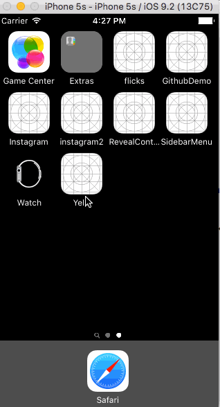

# Project 3 - *Yelp*

Time spent: **6** hours spent in total

## User Stories

The following **required** functionality is complete:

- [x] Table rows for search results should be dynamic height according to the content height.
- [x] Custom cells should have the proper Auto Layout constraints.
- [x] Search bar should be in the navigation bar (doesn't have to expand to show location like the real Yelp app does).

## Video Walkthrough 

Here's a walkthrough of implemented user stories:

 

 GIF created with [LiceCap](http://www.cockos.com/licecap/).

## Notes

Describe any challenges encountered while building the app.
 - Getting the autolayout to work and look correct was difficult and at times, annoying.

## License

Copyright [2016] [Vincent Le]

Licensed under the Apache License, Version 2.0 (the "License");
you may not use this file except in compliance with the License.
You may obtain a copy of the License at

http://www.apache.org/licenses/LICENSE-2.0

Unless required by applicable law or agreed to in writing, software
distributed under the License is distributed on an "AS IS" BASIS,
WITHOUT WARRANTIES OR CONDITIONS OF ANY KIND, either express or implied.
See the License for the specific language governing permissions and
limitations under the License.

